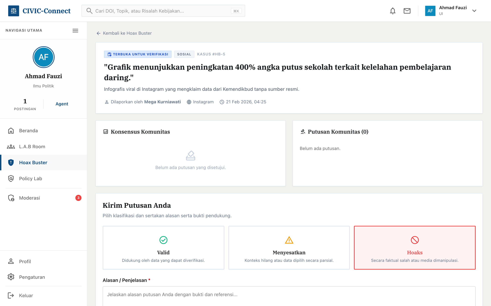
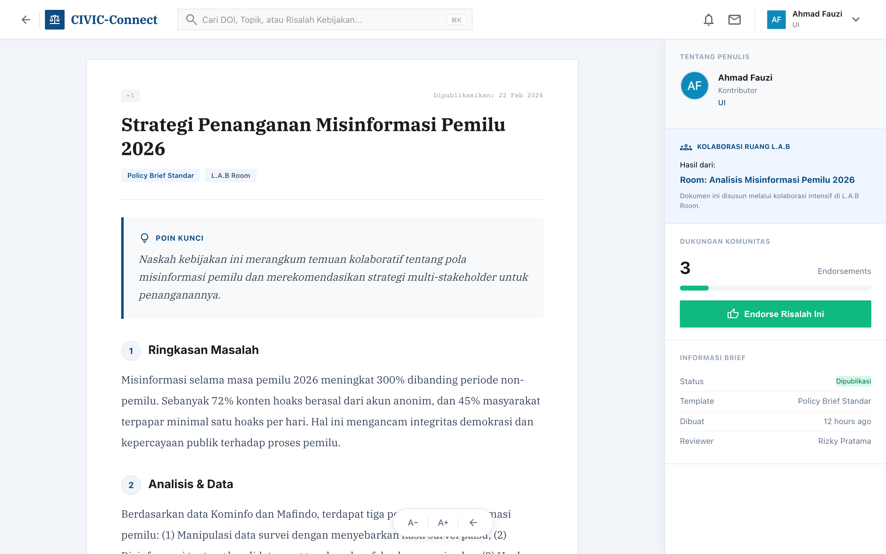
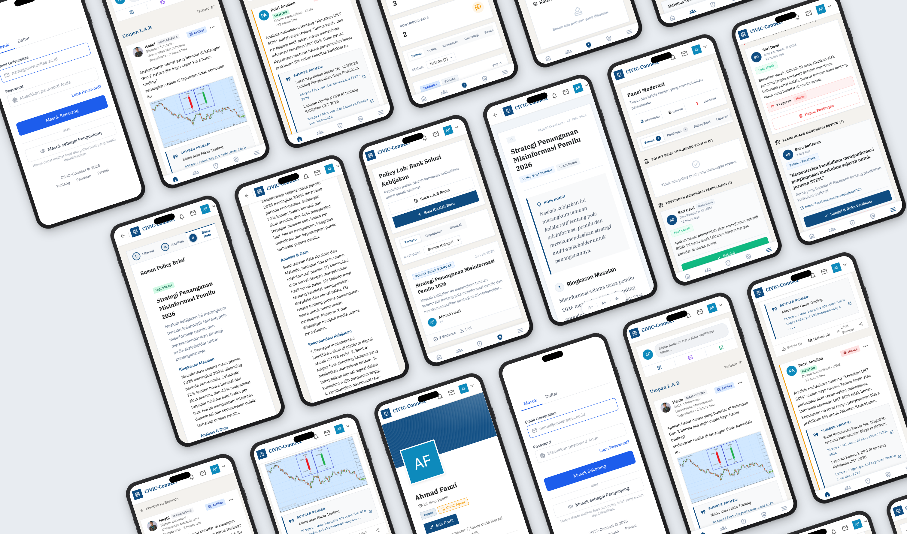

# CIVIC LAB (Cipta Intelektual Visioner Indonesia Cerdas)

## Metode Literasi Analisis Berbasis-Data dalam Melawan Disrupsi Informasi dan Krisis Demokrasi

---

## 1. Pendahuluan

Masyarakat Antifitnah Indonesia (Mafindo) mencatat **1.593 kasus hoaks** beredar sepanjang tahun 2025, dengan dominasi isu politik mencapai 48,5% (Rahayu, 2026). Angka ini bukan sekadar statistik — ia merupakan cerminan dari krisis epistemologis yang menggerogoti fondasi demokrasi Indonesia. Di tengah penetrasi internet yang mencapai 78,19% populasi (APJII, 2024), ruang publik digital justru terjebak dalam apa yang disebut Wardle dan Derakhshan (2017) sebagai _information disorder_: ekosistem di mana _misinformation_, _disinformation_, dan _malinformation_ bercampur hingga mengaburkan batas antara fakta dan fiksi. Laporan _Digital Civility Index_ (DCI) oleh Microsoft mengonfirmasi bahwa tingkat kesopanan warganet Indonesia termasuk yang terendah di Asia Tenggara — sebuah ironi bagi bangsa yang secara kultural menjunjung tinggi nilai keramahan. Hal ini menunjukkan bahwa tingginya konektivitas digital tidak secara otomatis melahirkan kematangan bernalar; justru sebaliknya, ekosistem informasi yang tidak terkendali telah mengikis norma kesantunan yang selama ini menjadi identitas kultural bangsa.

Paradoks ini tidak berhenti pada masyarakat umum. Mahasiswa, yang secara normatif diposisikan sebagai agen intelektual dan penjaga rasionalitas publik, kini rentan terjangkit virus _doomscrolling_ — perilaku konsumsi berita negatif secara kompulsif yang memicu kecemasan dan memengaruhi cara individu memproses realitas sosial (Satici et al., 2023). Paparan informasi negatif yang repetitif ini bukan hanya berdampak pada kesejahteraan psikologis, melainkan juga menggeser orientasi gerakan intelektual mahasiswa dari yang seharusnya berbasis data menjadi berbasis sentimen. Akibatnya, diskursus akademik di kampus yang semestinya menjadi kawah candradimuka gagasan sering kali terjebak dalam _echo chamber_ — ruang informasi tertutup yang secara algoritmis memperkuat narasi tertentu dan mematikan dialektika (Lim, 2017). Fenomena ini sejalan dengan konsep "matinya kepakaran" (_the death of expertise_) yang dikemukakan Nichols (2017), yakni situasi ketika emosi dan keyakinan personal lebih dipercaya dibandingkan data empiris — sebuah krisis yang berimplikasi serius terhadap kualitas demokrasi, karena warga negara yang tidak mampu membedakan fakta dari opini akan rentan terhadap manipulasi aktor politik yang mendistribusi disinformasi secara terorganisir.

Kondisi ini terkonfirmasi melalui **Survei Literasi Digital dan Kompetensi Advokasi Kebijakan Publik** yang penulis lakukan pada Februari 2026 terhadap **47 responden mahasiswa** lintas perguruan tinggi menggunakan kuesioner daring dengan teknik _purposive sampling_. Meskipun sampel ini belum merepresentasikan populasi mahasiswa secara nasional, temuan survei mengungkap dua pola yang mengkhawatirkan. Pertama, **mayoritas responden menyatakan bahwa diskusi atau debat di kampus mereka lebih didominasi oleh asumsi dan opini pribadi dibandingkan data valid** — mengindikasikan lemahnya _information seeking skills_, di mana preferensi pribadi mengalahkan verifikasi fakta (Lim, 2017; Syam & Nurrahmi, 2020). Kedua, **lebih dari 75% responden mengaku tidak mengetahui atau tidak mampu menyusun Naskah Rekomendasi Kebijakan (Policy Brief)**. Absennya kemampuan ini menyebabkan gerakan mahasiswa sering kali bersifat spontan dan emosional tanpa menawarkan solusi konkret — sebuah ironi mengingat demonstrasi dan advokasi seharusnya menjadi instrumen demokratis yang paling efektif justru ketika didukung oleh argumen berbasis data. Tanpa argumen yang terstruktur, kritik mahasiswa kehilangan kekuatan negosiasinya di hadapan pengambil keputusan, sehingga peran mereka sebagai penyeimbang demokrasi sulit terealisasi.

Berdasarkan permasalahan tersebut, esai ini menawarkan gagasan **CIVIC LAB** (_Cipta Intelektual Visioner Indonesia Cerdas_) sebagai ekosistem inkubasi nalar kritis dan advokasi berbasis riset yang terintegrasi dalam platform digital **CIVIC-Connect**. Urgensi gagasan ini diperkuat oleh hasil survei di mana **95,7% responden menyatakan "Butuh" hingga "Sangat Butuh"** terhadap pelatihan penyusunan Policy Brief, dan **95,7% berminat menggunakan platform digital anti-hoaks** jika tersedia. Melalui CIVIC LAB, mahasiswa didorong bertransformasi dari konsumen informasi yang reaktif menjadi penggagas kebijakan yang solutif.

---

## 2. Kerangka Teoretis dan Landasan Gagasan

### 2.1 Tiga Pilar Kerangka Berpikir

Gagasan CIVIC LAB berpijak pada tiga kerangka teoretis utama yang saling melengkapi.

**Pertama**, _Information Disorder Framework_ oleh Wardle dan Derakhshan (2017) yang mengklasifikasikan gangguan informasi ke dalam tiga kategori: _misinformation_ (informasi salah tanpa niat jahat), _disinformation_ (informasi salah yang sengaja disebarkan), dan _malinformation_ (informasi benar yang digunakan untuk menyakiti). Klasifikasi ini penting karena respons terhadap masing-masing jenis gangguan memerlukan pendekatan yang berbeda — _misinformation_ membutuhkan edukasi, _disinformation_ membutuhkan deteksi dan regulasi, sementara _malinformation_ membutuhkan literasi kontekstual. Kebanyakan inisiatif anti-hoaks yang ada saat ini memperlakukan semua gangguan informasi secara seragam dengan label "hoaks," yang justru menyederhanakan masalah secara berlebihan dan mengurangi efektivitas intervensi. Kerangka ini menjadi dasar perancangan fitur **Pusat Penumpas Hoaks** di platform CIVIC-Connect, di mana mahasiswa dilatih untuk mengidentifikasi dan mengklasifikasikan jenis gangguan informasi secara sistematis sebelum memberikan putusan, sehingga proses verifikasi menjadi lebih presisi dan edukatif.

**Kedua**, teori _Deliberative Democracy_ oleh Habermas (1996) yang menekankan pentingnya deliberasi publik yang rasional dan inklusif sebagai fondasi demokrasi yang sehat. Inti argumen Habermas terletak pada konsep _ideal speech situation_: kondisi di mana setiap partisipan memiliki kesempatan yang setara untuk menyampaikan argumen, dan keputusan ditentukan semata-mata oleh kekuatan argumen terbaik (_the unforced force of the better argument_), bukan oleh hierarki kekuasaan atau volume suara. Prinsip ini sangat relevan dengan konteks mahasiswa Indonesia, di mana diskusi publik — baik di dalam maupun di luar kampus — sering kali didominasi oleh senioritas, afiliasi organisasi, atau popularitas di media sosial, sehingga suara-suara yang memiliki argumen kuat namun kurang "terkenal" sering tenggelam. CIVIC-Connect mengoperasionalkan prinsip ini melalui mekanisme **diskusi berthreaded** dan **Top Voting**, di mana gagasan terkuat secara argumentatif mendapat visibilitas tertinggi berdasarkan penilaian komunitas — bukan berdasarkan siapa yang menyampaikannya. Fishkin (2018) menunjukkan bahwa prinsip deliberasi Habermas dapat dioperasionalkan secara efektif dalam konteks digital kontemporer melalui desain platform yang mendorong partisipasi setara dan argumentasi berbasis bukti.

**Ketiga**, _Media and Information Literacy_ (MIL) Framework oleh UNESCO (2021) yang mendefinisikan literasi media dan informasi sebagai kompetensi untuk mengakses, menganalisis, mengevaluasi, dan memproduksi informasi secara kritis. Yang membedakan kerangka MIL dari pendekatan literasi konvensional adalah penekanannya pada dimensi **produktif**: individu yang literat secara media bukan hanya mampu "membaca" informasi secara kritis, tetapi juga mampu **memproduksi** konten yang berkualitas dan bertanggung jawab. Dimensi produktif inilah yang sering absen dalam program literasi digital di Indonesia — sebagian besar inisiatif berhenti pada tahap "jangan percaya hoaks" tanpa membekali peserta dengan kemampuan menghasilkan alternatif informasi yang terverifikasi. CIVIC LAB menerjemahkan dimensi ini melalui tahap Basis Data, di mana mahasiswa tidak hanya belajar memilah informasi, tetapi menghasilkan **Policy Brief** sebagai produk intelektual konkret yang dapat digunakan untuk memengaruhi kebijakan publik.

### 2.2 Landasan Filosofis Lokal

Secara filosofis, CIVIC LAB mengadopsi konsep kepemimpinan pendidikan **Ki Hajar Dewantara**, yaitu **"Neng, Ning, Nung, Nang"** (Dewantara, 1977), yang diterjemahkan ke dalam empat tahap transformasi nalar mahasiswa:

- **Neng (Meneng):** Mahasiswa diajak untuk tenang dan tidak reaktif dalam menerima informasi — menahan diri dari _doomscrolling_.
- **Ning (Wening):** Berpikir jernih (_critical thinking_) dalam memverifikasi fakta melalui literasi kontekstual.
- **Nung (Hanung):** Kuat hati dan berani merumuskan gagasan atau solusi melalui analisis berbasis bukti.
- **Nang (Menang):** Menghasilkan kemenangan berupa Policy Brief atau solusi yang berdampak bagi masyarakat.

Keempat tahap ini secara langsung berkorespondensi dengan metode L.A.B yang akan diuraikan di Bagian 3: _Neng_ dan _Ning_ melandasi tahap Literasi, _Nung_ melandasi tahap Analisis, dan _Nang_ melandasi tahap Basis Data. Dengan demikian, kearifan lokal tidak sekadar menjadi hiasan retoris, melainkan berfungsi sebagai _philosophical scaffolding_ yang menopang seluruh kerangka metodologis CIVIC LAB.

Visi utama gagasan ini terangkum dalam akronim **C.I.V.I.C**, yang merepresentasikan profil pemuda yang ingin dibentuk:

| Huruf | Makna           | Penjelasan                                                                                                         |
| ----- | --------------- | ------------------------------------------------------------------------------------------------------------------ |
| **C** | **Cipta**       | Menegaskan peran mahasiswa sebagai pencipta gagasan solutif, bukan sekadar penyebar ulang (_forwarder_) informasi. |
| **I** | **Intelektual** | Mengedepankan nalar dan logika ilmiah di atas emosi dalam merespons isu publik.                                    |
| **V** | **Visioner**    | Berorientasi pada dampak jangka panjang bagi Indonesia Emas 2045, tidak terjebak pada konflik jangka pendek.       |
| **I** | **Indonesia**   | Memiliki pijakan nilai kebangsaan, kebinekaan, dan persatuan yang kuat sebagai landasan berpikir.                  |
| **C** | **Cerdas**      | Cerdas secara digital dalam memilah informasi dan cerdas sosial dalam berinteraksi dengan masyarakat.              |

### 2.3 Analisis Komparatif: Mengapa CIVIC LAB Diperlukan?

Beberapa inisiatif anti-hoaks dan literasi digital telah eksis di Indonesia, namun masing-masing memiliki keterbatasan yang menyisakan celah signifikan. Berdasarkan observasi penulis terhadap fitur dan model operasional dari masing-masing platform yang dapat diakses publik, serta merujuk pada kajian Rahayu et al. (2019) tentang lanskap _fact-checking_ di Indonesia, dapat diidentifikasi peta posisi berikut:

| Platform / Inisiatif          | Fokus Utama                                         | Keterbatasan                                                                                                                                                                                                     |
| ----------------------------- | --------------------------------------------------- | ---------------------------------------------------------------------------------------------------------------------------------------------------------------------------------------------------------------- |
| **TurnBackHoax.id** (Mafindo) | Verifikasi hoaks oleh jurnalis dan relawan terlatih | Beroperasi dengan model _top-down_ — hasil verifikasi diproduksi oleh tim ahli dan dikonsumsi oleh publik, sehingga mahasiswa tidak mendapat kesempatan berpartisipasi aktif dalam proses verifikasi itu sendiri |
| **CekFakta.com** (AJI & AMSI) | _Fact-checking_ jurnalistik profesional             | Fokus pada jurnalisme profesional; tidak menyediakan ruang kolaborasi atau pelatihan bagi mahasiswa untuk mengembangkan kemampuan verifikasi mandiri                                                             |
| **Siberkreasi** (Kominfo)     | Kampanye literasi digital nasional                  | Didominasi pendekatan sosialisasi dan edukasi satu arah (Kominfo, 2021); tidak menghasilkan output kebijakan yang terukur dari pesertanya                                                                        |
| **Kialo / Piazza** (Global)   | Platform diskusi terstruktur                        | Tidak dirancang untuk konteks Indonesia dan tidak terintegrasi dengan ekosistem advokasi kebijakan lokal                                                                                                         |

CIVIC LAB mengisi celah tersebut melalui pendekatan yang **mengintegrasikan tiga fungsi sekaligus**: (1) verifikasi kolaboratif yang menempatkan mahasiswa sebagai subjek aktif, bukan objek pasif; (2) ruang riset terstruktur yang memandu proses berpikir dari literasi hingga analisis; dan (3) output konkret berupa Policy Brief yang siap diajukan kepada pengambil kebijakan. Ketiga fungsi ini saling terkait secara arsitektural — hasil verifikasi di Pusat Penumpas Hoaks menjadi bahan analisis di L.A.B Room, dan temuan analisis menjadi dasar penyusunan Policy Brief di Policy Lab. Tidak ada platform yang saat ini menggabungkan ketiga fungsi tersebut dalam satu alur kerja terintegrasi.

---

## 3. Gagasan: CIVIC LAB dan Metode L.A.B

### 3.1 CIVIC LAB sebagai Laboratorium Sosial Kampus

CIVIC LAB adalah **"laboratorium sosial"** yang dirancang sebagai ruang inkubasi di kampus bagi mahasiswa untuk menguji kebenaran informasi, membedah masalah kerakyatan, dan meracik solusi kebijakan. Berbeda dengan komunitas diskusi konvensional, CIVIC LAB bukan sekadar _forum_ — melainkan ekosistem inkubasi literasi berbasis data yang mentransformasi mahasiswa dari _passive consumer of information_ menjadi _active policy solver_.

Keunggulan CIVIC LAB terletak pada metodologi kerjanya yang sistematis, yang disebut dengan **metode L.A.B** (_Literasi — Analisis — Basis Data_). Metode ini dirancang sebagai antitesis dari budaya "asal bunyi" yang marak di media sosial, dan telah diimplementasikan dalam platform digital CIVIC-Connect. Alur kerja metode L.A.B dapat divisualisasikan melalui diagram berikut:

**Gambar 1. Diagram Alur Metode L.A.B**

```
┌─────────────────────┐     ┌──────────────────────┐     ┌─────────────────────────┐
│   L — LITERASI      │     │   A — ANALISIS       │     │   B — BASIS DATA        │
│   KONTEKSTUAL       │────▶│   KRITIS             │────▶│   (OUTPUT & AKSI)       │
│   (Input)           │     │   (Proses)           │     │                         │
├─────────────────────┤     ├──────────────────────┤     ├─────────────────────────┤
│ • Verifikasi        │     │ • Diskusi            │     │ • Penyusunan Policy     │
│   kolaboratif       │     │   berthreaded        │     │   Brief terstruktur     │
│ • Kurasi sumber     │     │ • Kerangka klaim &   │     │ • Moderasi kualitas     │
│   referensi         │     │   bukti              │     │   oleh CIVIC Agent      │
│ • Klasifikasi       │     │ • Top Voting untuk   │     │ • Publikasi ke Bank     │
│   information       │     │   visibilitas        │     │   Solusi Kebijakan      │
│   disorder          │     │   argumentatif       │     │   (Policy Lab)          │
├─────────────────────┤     ├──────────────────────┤     ├─────────────────────────┤
│ Pilar Teori:        │     │ Pilar Teori:         │     │ Pilar Teori:            │
│ Information Disorder│     │ Deliberative         │     │ UNESCO MIL — dimensi    │
│ (Wardle, 2017)      │     │ Democracy            │     │ produktif               │
│ + UNESCO MIL —      │     │ (Habermas, 1996)     │     │ (UNESCO, 2021)          │
│ pilar access &      │     │                      │     │                         │
│ evaluate            │     │                      │     │                         │
├─────────────────────┤     ├──────────────────────┤     ├─────────────────────────┤
│ Filosofi: Neng +    │     │ Filosofi: Nung       │     │ Filosofi: Nang          │
│ Ning (KHD)          │     │ (KHD)                │     │ (KHD)                   │
└─────────────────────┘     └──────────────────────┘     └─────────────────────────┘
```

### 3.2 Tahap L — Literasi Kontekstual (Input)

Tahap pertama menjawab permasalahan paling mendasar yang teridentifikasi dari survei: ketidakmampuan mahasiswa memilah informasi yang valid. Wardle dan Derakhshan (2017) mengidentifikasi bahwa gangguan informasi bukan fenomena tunggal, melainkan spektrum yang mencakup tiga jenis berbeda — masing-masing dengan akar penyebab, aktor, dan dampak yang berbeda pula. Memahami perbedaan ini krusial karena strategi penanggulangan yang tepat bergantung pada diagnosis yang akurat: memberi label "hoaks" pada semua jenis gangguan informasi sama kelirunya dengan memberikan obat yang sama untuk semua jenis penyakit. Tahap Literasi melatih mahasiswa untuk melakukan **verifikasi kolaboratif** — bukan hanya membaca, tetapi menguji kebenaran informasi secara kolektif dengan memperhatikan nuansa kategoris ini.

Verifikasi akan lebih efektif jika dilakukan secara kolaboratif oleh komunitas yang beragam, bukan hanya oleh segelintir ahli. Becker et al. (2017) menunjukkan melalui eksperimen bahwa agregasi penilaian independen dari banyak individu menghasilkan keputusan yang lebih akurat — dengan syarat bahwa penilaian tersebut dilakukan secara independen sebelum terpapar pengaruh sosial. Temuan ini mengonfirmasi empat kondisi kecerdasan kolektif: keragaman opini, independensi, desentralisasi, dan mekanisme agregasi. Melalui fitur **Pusat Penumpas Hoaks** di platform CIVIC-Connect, keempat kondisi ini dipenuhi secara arsitektural: keragaman opini dijamin melalui partisipasi mahasiswa lintas disiplin dan lintas kampus; independensi dijaga karena setiap pengguna memberikan putusan sebelum melihat putusan orang lain; desentralisasi terwujud melalui ketiadaan otoritas tunggal yang menentukan hasil verifikasi; dan mekanisme agregasi dioperasionalkan melalui konsensus berbasis persentase suara. Dengan demikian, Pusat Penumpas Hoaks bukan sekadar forum opini, melainkan sistem verifikasi yang secara desain memanfaatkan kecerdasan kolektif.

Selain verifikasi hoaks, dalam L.A.B Room tahap Literasi juga difasilitasi melalui fitur **kurasi sumber referensi** secara kolaboratif. Setiap peserta dapat menambahkan sumber literatur dengan judul, URL, dan ringkasan konten, sehingga terbangun basis data referensi bersama sebelum memasuki tahap analisis. Proses ini selaras dengan pilar _access_ dan _evaluate_ dalam kerangka MIL UNESCO (2021) — mahasiswa tidak hanya mengakses informasi, tetapi secara aktif mengevaluasi dan mengkurasi kredibilitasnya. Kegiatan kurasi kolaboratif ini melatih kemampuan yang jarang diajarkan secara formal di perguruan tinggi: bagaimana menilai kualitas sumber, membandingkan kredibilitas antar-sumber, dan membangun basis pengetahuan bersama secara sistematis. Operasionalisasi prinsip kecerdasan kolektif dalam proses verifikasi hoaks pada platform CIVIC-Connect dapat dilihat pada Gambar 3.

**Gambar 3**

_Antarmuka Fitur Pusat Penumpas Hoaks pada Platform CIVIC-Connect_



_Catatan._ Tampilan menunjukkan operasionalisasi prinsip kecerdasan kolektif (Becker et al., 2017) dalam proses verifikasi hoaks. Pengguna memberikan putusan independen sebelum melihat hasil agregasi komunitas, memenuhi syarat independensi dan desentralisasi yang menjadi landasan kerangka _Information Disorder_ (Wardle & Derakhshan, 2017).

### 3.3 Tahap A — Analisis Kritis (Proses)

Setelah basis literasi terbangun, mahasiswa memasuki tahap yang secara substansial mengoperasionalkan prinsip _Deliberative Democracy_ Habermas (1996). Habermas berargumen bahwa legitimasi sebuah kesimpulan atau keputusan bergantung pada kualitas proses diskursif yang mendasarinya — sebuah argumen dianggap sahih bukan karena siapa yang menyampaikannya, melainkan karena kekuatan internal dari argumen itu sendiri. Dalam konteks mahasiswa Indonesia, prinsip ini menjadi sangat relevan karena diskusi di kampus sering kali didominasi oleh senioritas, afiliasi organisasi, atau jumlah _follower_ di media sosial, sehingga gagasan yang secara substansial lebih kuat tetapi berasal dari mahasiswa "biasa" sering kali tenggelam. Tahap Analisis dirancang untuk membalikkan dinamika ini.

Di dalam **ruang diskusi berthreaded**, mahasiswa membedah masalah menggunakan kerangka **klaim (_claim_) dan bukti (_evidence_)** yang terstruktur. Diskusi tidak boleh berbasis asumsi ("katanya"), melainkan setiap argumen harus didukung oleh bukti yang dapat diverifikasi — prinsip yang sejalan dengan konseptualisasi berpikir kritis sebagai praktik diskursif yang terstruktur (Kuhn, 2019), di mana setiap argumen harus dibangun dari klaim yang didukung bukti dan penalaran eksplisit. Platform menyediakan sistem **Top Voting** pada setiap komentar, di mana argumen yang dinilai paling berkualitas oleh peserta lain akan muncul paling atas. Berbeda dengan mekanisme _like_ di media sosial yang cenderung mempromosikan konten paling provokatif atau paling emosional, Top Voting dirancang agar visibilitas ditentukan oleh kekuatan argumentasi. Mekanisme ini secara langsung memerangi bias konfirmasi — kecenderungan untuk hanya memprioritaskan informasi yang memperkuat keyakinan awal (Kappes et al., 2020) — karena argumen yang menantang konsensus tetap memiliki peluang yang sama untuk mendapat visibilitas tinggi jika didukung oleh bukti yang kuat. Gambar 4 menunjukkan antarmuka diskusi berthreaded yang mengoperasionalkan prinsip deliberasi ini.

**Gambar 4**

_Antarmuka Ruang Diskusi Berthreaded dan Mekanisme Top Voting pada L.A.B Room_


_Catatan._ Tampilan menunjukkan implementasi prinsip _Deliberative Democracy_ (Habermas, 1996) dalam ruang diskusi digital. Sistem Top Voting memastikan visibilitas argumen ditentukan oleh kekuatan substansi, bukan oleh popularitas atau senioritas penyampai, sehingga mewujudkan kondisi _ideal speech situation_ dalam konteks platform digital.

### 3.4 Tahap B — Basis Data (Output & Aksi)

Inilah **pembeda utama** CIVIC LAB dengan kelompok diskusi biasa dan seluruh platform anti-hoaks yang telah diidentifikasi di Bagian 2.3. Sementara TurnBackHoax dan CekFakta berhenti pada tahap verifikasi, dan Siberkreasi berhenti pada tahap edukasi, CIVIC LAB melangkah lebih jauh dengan mengkonversi hasil analisis menjadi **Naskah Kebijakan (Policy Brief)** terstruktur. Tahap ini mengoperasionalkan dimensi produktif dari kerangka MIL UNESCO (2021): mahasiswa tidak hanya menjadi konsumen kritis terhadap informasi, tetapi juga menjadi **produsen** rekomendasi kebijakan yang berbasis data.

Urgensitas tahap ini diperkuat oleh temuan survei di mana **lebih dari 75% responden mengaku tidak mengetahui atau tidak mampu menyusun Policy Brief** — sebuah kesenjangan kompetensi yang serius mengingat Policy Brief merupakan instrumen advokasi yang paling lazim digunakan untuk memengaruhi kebijakan publik (Cairney & Kwiatkowski, 2017). Tanpa kemampuan ini, energi perubahan yang dimiliki mahasiswa tidak memiliki "wadah institusional" yang memungkinkannya diterjemahkan menjadi pengaruh kebijakan yang nyata.

Platform CIVIC-Connect menjawab kesenjangan ini dengan menyediakan **tiga template standar** yang memandu mahasiswa dalam penyusunan:

| Template              | Deskripsi                                                                       |
| --------------------- | ------------------------------------------------------------------------------- |
| **Standar**           | Template umum cocok untuk berbagai isu kebijakan                                |
| **Data-Driven Brief** | Template yang menekankan pada penyajian data kuantitatif dan statistik          |
| **Quick Response**    | Template ringkas untuk merespons isu kebijakan yang membutuhkan tanggapan cepat |

Setiap Policy Brief yang dihasilkan melewati proses **moderasi kualitas** oleh CIVIC Agent — mahasiswa terlatih yang berperan sebagai penjaga standar konten — sebelum dipublikasikan ke repositori terbuka **Bank Solusi Kebijakan (Policy Lab)**. Adanya proses moderasi ini krusial untuk menjaga kredibilitas output: tanpa kontrol kualitas, repositori kebijakan berisiko diisi oleh dokumen yang prematur atau tidak memenuhi standar argumentasi akademik, yang pada akhirnya justru akan merusak legitimasi seluruh ekosistem CIVIC LAB di mata pengambil kebijakan. Tampilan antarmuka penyusunan Policy Brief pada platform ditunjukkan pada Gambar 5.

**Gambar 5**

_Antarmuka Penyusunan dan Tampilan Policy Brief pada Policy Lab CIVIC-Connect_



_Catatan._ Tampilan menunjukkan operasionalisasi dimensi produktif kerangka MIL UNESCO (2021) — mahasiswa tidak hanya mengevaluasi informasi, tetapi menghasilkan Naskah Kebijakan (Policy Brief) terstruktur sebagai produk intelektual konkret yang siap diajukan kepada pengambil kebijakan.

---

## 4. Platform CIVIC-Connect: Implementasi dan Ekosistem Digital

Untuk memperluas dampak di era digital, seluruh metode L.A.B dioperasionalkan melalui platform terintegrasi bernama **CIVIC-Connect** yang telah dibangun secara fungsional.¹ Platform ini dirancang bukan sebagai media sosial biasa, melainkan sebagai **infrastruktur epistemik** — ruang digital yang secara arsitektural mendorong penggunanya untuk berpikir kritis, bukan reaktif. Arsitekturnya ditunjukkan pada Gambar 2 berikut.

**Gambar 2. Arsitektur Ekosistem Platform CIVIC-Connect**

```
                        ┌──────────────────────────────┐
                        │     CIVIC-Connect Platform   │
                        │    (Infrastruktur Epistemik)  │
                        └──────────┬───────────────────┘
                                   │
          ┌────────────────────────┼────────────────────────┐
          │                        │                        │
          ▼                        ▼                        ▼
┌──────────────────┐   ┌──────────────────┐   ┌──────────────────┐
│  Pusat Penumpas  │   │    L.A.B Room    │   │    Policy Lab    │
│     Hoaks        │──▶│ (Ruang Riset     │──▶│ (Bank Solusi     │
│ (Verifikasi)     │   │  Kolaboratif)    │   │  Kebijakan)      │
└──────────────────┘   └──────────────────┘   └──────────────────┘
          │                        │                        │
          ▼                        ▼                        ▼
┌──────────────────┐   ┌──────────────────┐   ┌──────────────────┐
│ Leaderboard      │   │ 3 Fase:          │   │ 3 Template:      │
│ Verifikator      │   │ L → A → B        │   │ Standar /        │
│ (Gamifikasi)     │   │ (Berurutan)      │   │ Data-Driven /    │
│                  │   │                  │   │ Quick Response   │
└──────────────────┘   └──────────────────┘   └──────────────────┘
                                   │
                        ┌──────────┴──────────┐
                        │                     │
                        ▼                     ▼
              ┌──────────────────┐  ┌──────────────────┐
              │ Feed Beranda     │  │ Sistem Moderasi  │
              │ • Fact-check     │  │ oleh CIVIC Agent │
              │ • Artikel        │  │ (Kontrol         │
              │ • Label Sumber   │  │  Kualitas)       │
              │ • Top Voting     │  │                  │
              └──────────────────┘  └──────────────────┘
```

Arsitektur platform dibangun di atas empat prinsip desain utama yang masing-masing menjawab permasalahan spesifik:

**Pertama, kontrol kualitas berlapis.** Seluruh konten — postingan, Policy Brief, klaim hoaks, dan putusan verifikasi — melewati proses moderasi oleh CIVIC Agent sebelum tampil secara publik. Selain itu, pengguna dapat melaporkan konten bermasalah yang kemudian ditindaklanjuti melalui panel moderasi, menciptakan komunitas yang _self-governing_. Pendekatan ini mengadopsi konsep _community governance_ sebagaimana dipraktikkan dalam platform kolaboratif sukses seperti Wikipedia, di mana Matias (2019) menunjukkan melalui eksperimen skala besar pada 2.190 diskusi daring bahwa norma sosial komunitas secara signifikan meningkatkan partisipasi dan mengurangi perilaku yang merugikan — mendukung prinsip bahwa tata kelola berbasis komunitas dapat menjaga kualitas konten secara keseluruhan, karena rasa kepemilikan bersama (_shared ownership_) mendorong partisipan untuk saling menjaga standar. Dalam konteks CIVIC-Connect, prinsip ini diterjemahkan melalui kombinasi moderasi oleh CIVIC Agent (kontrol terpusat) dan sistem pelaporan oleh pengguna (kontrol terdesentralisasi), menciptakan mekanisme _checks and balances_ untuk menjaga kualitas informasi.

**Kedua, insentif berbasis kualitas argumentasi.** Sistem **Top Voting** dan **endorsement** memastikan bahwa visibilitas konten ditentukan oleh kekuatan argumentasi, bukan popularitas. **Leaderboard Verifikator** memberikan rekognisi terhadap kontributor paling aktif dalam verifikasi hoaks. Sailer dan Homner (2020) menunjukkan melalui meta-analisis bahwa elemen gamifikasi — termasuk papan peringkat, lencana, dan poin — secara signifikan meningkatkan motivasi dan keterlibatan pengguna dalam konteks pembelajaran. Dalam CIVIC-Connect, elemen kompetitif melalui Leaderboard berfungsi ganda: ia tidak hanya mendorong partisipasi berkelanjutan melalui motivasi ekstrinsik (rekognisi publik), tetapi juga secara bertahap menumbuhkan motivasi intrinsik karena kontributor mengalami langsung nilai dari kegiatan verifikasi yang mereka lakukan. Pendekatan ini menjadi strategi kunci untuk melawan budaya _doomscrolling_ — menjadikan proses pembuatan kajian sama menarik dan _rewarding_ seperti aktivitas konsumsi konten pasif.

**Ketiga, transparansi epistemik.** Setiap postingan _fact-check_ dilengkapi fitur **"Lihat Sumber"** yang menampilkan sitasi/referensi yang digunakan penulis. Postingan tanpa referensi ditandai dengan label peringatan **"Tanpa Sumber"** — sebuah intervensi yang efektif tanpa bersifat restriktif. Thaler dan Sunstein (2021) menunjukkan bahwa perubahan _choice architecture_ — cara pilihan disajikan kepada individu — dapat mendorong perilaku yang lebih baik tanpa membatasi kebebasan, sebuah pendekatan yang mereka sebut _nudge_. Label "Tanpa Sumber" adalah _nudge_ yang bekerja melalui _social proof_: ketika pengguna melihat bahwa sebagian besar postingan berkualitas menyertakan sumber, mereka terdorong untuk melakukan hal yang sama bukan karena dipaksa, melainkan karena tidak ingin kontennya terlihat kurang kredibel. Dengan demikian, budaya akademik — kebiasaan menyertakan referensi — ditanamkan secara organik tanpa aturan yang koersif.

**Keempat, aksesibilitas dan keamanan.** Platform menyediakan **mode akses anonim** yang memungkinkan pengguna mengakses konten tanpa mendaftarkan identitas. Tapsell (2020) mendokumentasikan bahwa _chilling effect_ terhadap kebebasan berekspresi digital di Indonesia masih menjadi ancaman nyata, di mana pengguna media sosial — termasuk mahasiswa — sering kali melakukan _self-censorship_ karena takut akan konsekuensi sosial atau hukum dari kritik yang mereka sampaikan. Mode akses anonim memungkinkan mahasiswa berpartisipasi dalam diskusi isu sensitif tanpa ketakutan akan _doxing_ atau intimidasi, mewujudkan komitmen platform terhadap prinsip _safe space_ bagi deliberasi publik.

Keempat prinsip desain di atas konvergen pada **Beranda (Feed)** — halaman utama yang menjadi simpul penghubung seluruh modul platform. Pada Beranda, mahasiswa dapat membuat dua jenis unggahan: **Artikel** untuk menyampaikan analisis mendalam terhadap isu publik, dan **Fact-Check** untuk memverifikasi klaim yang beredar di ruang digital. Setiap unggahan Fact-Check dilengkapi sistem **voting kolektif Fakta/Hoaks** yang memungkinkan pengguna lain ikut menilai kebenaran klaim secara partisipatif — mengoperasionalkan prinsip kecerdasan kolektif (Becker et al., 2017) secara langsung di arus informasi utama, bukan hanya di ruang khusus Pusat Penumpas Hoaks. Platform menyediakan fitur sitasi sumber primer agar setiap konten dapat ditelusuri dasar empirisnya; apabila unggahan tidak menyertakan sumber, sistem secara otomatis menampilkan label peringatan **"Tanpa Sumber"** sebagai _nudge_ transparansi (Thaler & Sunstein, 2021). Seluruh postingan tidak langsung terbit — konten harus melewati peninjauan oleh CIVIC Agent yang berwenang menyetujui atau menolak disertai alasan, sementara pengguna dapat melaporkan konten yang dinilai mengandung hoaks, _spam_, atau ujaran kebencian melalui menu pelaporan. Mekanisme moderasi berlapis ini — mulai dari peninjauan konten, klaim hoaks, putusan verifikasi, hingga _policy brief_ — memastikan bahwa setiap informasi yang beredar di ekosistem tetap berbasis data dan dapat dipertanggungjawabkan secara akademik.

Dengan arsitektur ini, CIVIC-Connect bukan sekadar wadah diskusi, melainkan **ekosistem epistemik** yang menghubungkan **verifikasi informasi** (Pusat Penumpas Hoaks), **riset kolaboratif** (L.A.B Room), dan **produksi kebijakan** (Policy Lab) melalui satu arus informasi yang koheren. Setiap modul saling memperkuat: hasil verifikasi di Pusat Penumpas Hoaks menjadi bahan diskusi di L.A.B Room, temuan analisis di L.A.B Room menjadi dasar penyusunan Policy Brief di Policy Lab, dan semua output tersirkulasi kembali melalui Beranda sebagai konten yang memperkaya literasi komunitas secara keseluruhan — menciptakan _virtuous cycle_ dari literasi menuju aksi kebijakan.

---

¹ Prototipe fungsional platform CIVIC-Connect dapat diakses di: https://civic-connect.example.com (diakses 25 Februari 2026). Tampilan lengkap seluruh antarmuka platform disajikan pada Lampiran 1.

---

## 5. Simulasi Penerapan dan Analisis Kelayakan

### 5.1 Bukti Konsep: Simulasi Terbatas

Untuk menguji kelayakan metode L.A.B secara empiris, penulis melakukan simulasi terbatas pada kelompok diskusi kecil beranggotakan **5 mahasiswa** dari latar disiplin yang berbeda (Hukum, Komunikasi, Teknik Informatika, Ilmu Politik, dan Kesehatan Masyarakat) untuk membahas isu **"Sampah Plastik di Kampus."** Pemilihan isu ini didasarkan pada relevansinya dengan kehidupan kampus sehari-hari dan ketersediaan data yang memadai untuk dianalisis. Dalam waktu **3 hari**, tim berhasil melewati ketiga tahap metode L.A.B:

| Tahap              | Kegiatan                                                                                                                                             | Capaian                                |
| ------------------ | ---------------------------------------------------------------------------------------------------------------------------------------------------- | -------------------------------------- |
| **L (Literasi)**   | Mengumpulkan 12 sumber data (volume sampah kampus dari bagian kebersihan, regulasi terkait, dan studi komparatif kebijakan kampus lain)              | Basis data referensi terbangun         |
| **A (Analisis)**   | Menganalisis penyebab perilaku buang sampah melalui diskusi berbasis bukti; mengidentifikasi 4 akar masalah menggunakan kerangka klaim-bukti         | Temuan analitis terstruktur            |
| **B (Basis Data)** | Menghasilkan satu draf usulan peraturan rektor tentang pengurangan plastik dalam format Policy Brief terstruktur (3 halaman, 5 rekomendasi spesifik) | 1 Policy Brief dengan skor rubrik 7/10 |

Untuk mengevaluasi kualitas output, penulis menggunakan rubrik penilaian sederhana dengan lima aspek (kejelasan masalah, kualitas data, kedalaman analisis, kelayakan rekomendasi, dan standar penulisan) pada skala 1-10. Policy Brief yang dihasilkan memperoleh skor rata-rata **7 dari 10**, dengan kejelasan masalah sebagai aspek terkuat (8/10) dan kedalaman analisis data sebagai aspek yang perlu ditingkatkan (6/10).

Penulis mengakui beberapa **limitasi penting** dari simulasi ini: (1) sampel 5 mahasiswa terlalu kecil untuk generalisasi; (2) tidak digunakan kelompok kontrol pembanding; (3) tidak dilakukan _pre-post test_ untuk mengukur perubahan kompetensi; dan (4) evaluator rubrik adalah penulis sendiri, sehingga berpotensi bias. Meskipun demikian, simulasi ini menunjukkan _proof of concept_ bahwa metode L.A.B yang terstruktur memungkinkan mahasiswa dari latar disiplin berbeda untuk menghasilkan output kebijakan yang konkret dalam waktu singkat. Temuan ini konsisten dengan penelitian Jones-Jang et al. (2021) yang menunjukkan bahwa intervensi literasi informasi yang terstruktur secara signifikan meningkatkan kemampuan deteksi berita palsu, bahkan dalam durasi pelatihan yang relatif singkat, karena struktur itu sendiri berfungsi sebagai _scaffolding_ kognitif yang memandu proses berpikir peserta.

### 5.2 Analisis Kelayakan (SWOT)

**Tabel 1. Analisis SWOT dan Strategi Keberlanjutan CIVIC LAB**

| Matriks SWOT                  | Analisis                                                                                                                                                                                                                                                                                                                                                                                                                                                                                                                                                                                                                                                                                       | Strategi Mitigasi / Penguatan                                                                                                                                                                                                                                                         |
| ----------------------------- | ---------------------------------------------------------------------------------------------------------------------------------------------------------------------------------------------------------------------------------------------------------------------------------------------------------------------------------------------------------------------------------------------------------------------------------------------------------------------------------------------------------------------------------------------------------------------------------------------------------------------------------------------------------------------------------------------- | ------------------------------------------------------------------------------------------------------------------------------------------------------------------------------------------------------------------------------------------------------------------------------------- |
| **Kekuatan (_Strengths_)**    | (1) **Validasi pasar tinggi:** 95,7% responden survei menyatakan berminat menggunakan platform digital kolaborasi kajian berbasis data. (2) **Metode terintegrasi:** Menggabungkan pelatihan offline (L.A.B) dengan platform digital (CIVIC-Connect) yang memiliki fitur Hoax Buster, L.A.B Room, dan Policy Lab dalam satu ekosistem. (3) **Output konkret:** Menghasilkan produk legal-akademis (Policy Brief) yang dipublikasikan ke repositori terbuka — keunggulan yang tidak dimiliki oleh platform anti-hoaks yang sudah ada. (4) **Kontrol kualitas bawaan:** Sistem moderasi berlapis oleh CIVIC Agent, mekanisme Top Voting, dan label "Tanpa Sumber" memastikan gagasan berkualitas mendapat visibilitas tertinggi. (5) **Prototipe fungsional terbangun:** Platform CIVIC-Connect telah dibangun sebagai prototipe yang dapat didemonstrasikan, bukan sekadar konsep di atas kertas — memperkuat kelayakan implementasi di mata pemangku kepentingan. | Mengajukan hak cipta (HaKI) atas platform CIVIC-Connect dan menjalin kemitraan dengan BEM Universitas se-Indonesia untuk mempercepat adopsi. Memperluas prototipe menjadi _Minimum Viable Product_ (MVP) melalui uji coba di 3 kampus percontohan pada Fase 1.                       |
| **Kelemahan (_Weaknesses_)**  | (1) **Kesenjangan kompetensi:** Lebih dari 75% responden mengaku tidak tahu atau tidak bisa membuat Policy Brief, menuntut intensitas pelatihan yang tinggi sebelum metode L.A.B dapat berjalan optimal. (2) **Keterbatasan sumber daya:** Pengembangan dan pemeliharaan server membutuhkan biaya operasional berkelanjutan. (3) **Validitas survei terbatas:** 47 responden dengan teknik _purposive sampling_ belum cukup merepresentasikan populasi mahasiswa secara nasional — diperlukan survei lanjutan dengan sampel yang lebih besar dan metode _random sampling_.                                                                                                                     | Mengintegrasikan modul pelatihan CIVIC LAB ke dalam program MBKM atau SKPI agar mahasiswa mendapat insentif akademik. Untuk pendanaan, mengikuti hibah kompetisi (PKM) dan kerja sama _sponsorship_. Melakukan survei lanjutan dengan minimal 200 responden dari 10 perguruan tinggi. |
| **Peluang (_Opportunities_)** | (1) **Agenda nasional:** Mendukung Peta Jalan Literasi Digital Kominfo, khususnya pilar _Digital Ethics_ dan _Digital Culture_ yang skornya masih perlu ditingkatkan (Kominfo, 2021). (2) **Ekosistem digital:** Penetrasi internet 78,19% yang didominasi Gen-Z memudahkan diseminasi via platform (APJII, 2024). (3) **Kolaborasi Penta Helix:** Potensi sinergi antara akademisi, pemerintah, industri, masyarakat, dan media untuk memperkuat ekosistem CIVIC LAB secara berkelanjutan.                                                                                                                                                                                                    | Memperluas Mode Akses Anonim menjadi sistem perlindungan privasi yang lebih komprehensif. Menjalin kerja sama institusional dengan Kemendikbud dan BSSN.                                                                                                                              |
| **Ancaman (_Threats_)**       | (1) **Serangan siber dan buzzer:** Risiko peretasan atau serangan opini terorganisir dari aktor yang anti-kritik. (2) **Budaya instan:** Tantangan mengubah kebiasaan _doomscrolling_ mahasiswa yang cenderung menyukai konten pendek dan viral. (3) **Disinformasi berbasis AI:** Perkembangan teknologi _generative AI_ memungkinkan produksi disinformasi yang semakin sulit dibedakan dari konten autentik, meningkatkan kompleksitas proses verifikasi bahkan bagi pengguna yang sudah literat secara digital.                                                                                                                                                                               | Mengembangkan sistem gamifikasi komprehensif (poin, _badge_, _reward_) untuk membuat proses kajian lebih menarik (Sailer & Homner, 2020). Mengintegrasikan modul pelatihan khusus deteksi konten _AI-generated_ ke dalam tahap Literasi L.A.B. Menjalin kerja sama dengan komunitas _fact-checker_ profesional (Mafindo, AJI) untuk memperbarui metodologi verifikasi seiring perkembangan teknologi. |

### 5.3 Peta Jalan Implementasi

Untuk memastikan keberlanjutan dan skalabilitas, CIVIC LAB dirancang dengan peta jalan implementasi bertahap:

| Fase                           | Jangka Waktu            | Target Capaian                                                                        | Indikator Keberhasilan                                                              |
| ------------------------------ | ----------------------- | ------------------------------------------------------------------------------------- | ----------------------------------------------------------------------------------- |
| **Fase 1: Pilot**              | Semester 1 (6 bulan)    | Uji coba di 3 kampus, melatih 15 CIVIC Agent, menghasilkan 10 Policy Brief            | Skor rata-rata Policy Brief ≥ 7/10 pada rubrik kualitas; minimal 100 pengguna aktif |
| **Fase 2: Ekspansi**           | Semester 2–3 (12 bulan) | Ekspansi ke 15 kampus, integrasi dengan program MBKM, membangun jaringan antar-kampus | Minimal 500 pengguna aktif; 1 Policy Brief diadopsi oleh institusi kampus           |
| **Fase 3: Institusionalisasi** | Tahun 2–3               | Menjangkau 50 kampus, membangun kemitraan formal dengan Kemendikbud dan DPRD          | 1 Policy Brief menjadi masukan formal dalam proses legislasi daerah                 |

---

## 6. Penutup

CIVIC LAB dengan platform CIVIC-Connect hadir sebagai jawaban atas tiga persoalan fundamental yang saling beririsan: lemahnya budaya verifikasi informasi, absennya keterampilan advokasi kebijakan di kalangan mahasiswa, dan tidak adanya wadah kolaboratif yang menjembatani gagasan intelektual dengan proses pengambilan keputusan. Melalui metode **L.A.B** yang berpijak pada kerangka _Information Disorder_ (Wardle & Derakhshan, 2017), _Deliberative Democracy_ (Habermas, 1996), dan _Media and Information Literacy_ (UNESCO, 2021), esai ini mengusulkan pendekatan yang tidak sekadar melawan hoaks, tetapi membangun **kapasitas epistemik** generasi muda untuk memproduksi solusi kebijakan berbasis data.

Keunggulan utama CIVIC LAB terletak pada integrasinya. Berdasarkan analisis komparatif di Bagian 2.3, tidak ada platform di Indonesia yang saat ini menggabungkan **verifikasi kolaboratif**, **riset terstruktur**, dan **produksi kebijakan** dalam satu ekosistem. TurnBackHoax dan CekFakta berhenti pada verifikasi, Siberkreasi berhenti pada edukasi, dan platform global seperti Kialo tidak memiliki konteks kebijakan Indonesia. CIVIC LAB mengisi celah ini dengan alur kerja terintegrasi di mana setiap tahap menghasilkan input untuk tahap berikutnya — menciptakan _virtuous cycle_ dari literasi menuju aksi kebijakan. Prototipe fungsional yang telah terbangun serta validasi dari **95,7% responden** yang menyatakan kebutuhan terhadap wadah ini membuktikan bahwa gagasan ini bukan utopia, melainkan solusi _demand-driven_ yang siap diuji coba lebih luas.

Sebagai rekomendasi, penulis mengusulkan tiga langkah strategis untuk fase pengembangan selanjutnya. **Pertama**, uji coba formal di 3 kampus percontohan dengan desain _pre-post test_ menggunakan instrumen literasi digital dan kompetensi advokasi yang tervalidasi — sehingga efektivitas metode L.A.B dapat diukur secara kuantitatif, melampaui limitasi simulasi terbatas yang telah dilakukan. **Kedua**, integrasi kurikulum melalui program MBKM agar pelatihan L.A.B mendapat pengakuan akademik berupa SKS atau SKPI, yang sekaligus menjawab tantangan terbesar CIVIC LAB: menjamin keberlanjutan partisipasi mahasiswa di tengah padatnya beban akademik. **Ketiga**, kemitraan institusional dengan Kemendikbud, Kominfo, dan DPRD agar Policy Brief yang dihasilkan memiliki jalur formal (_policy channel_) untuk dipertimbangkan dalam proses perumusan kebijakan — mengubah output CIVIC LAB dari sekadar latihan akademik menjadi instrumen advokasi yang memiliki dampak nyata.

Pada akhirnya, CIVIC LAB adalah tentang membentuk generasi mahasiswa yang memiliki **imunitas kognitif** — yang tenang saat menerima informasi (_Neng_), jernih saat berpikir (_Ning_), kuat saat merumuskan gagasan (_Nung_), dan menghasilkan kemenangan berupa solusi nyata bagi bangsa (_Nang_). Inilah wujud konkret dari **Cipta Intelektual Visioner Indonesia Cerdas** menuju Indonesia Emas 2045.

---

## Daftar Pustaka

APJII. (2024). _Survei penetrasi dan perilaku pengguna internet Indonesia 2024_. Asosiasi Penyelenggara Jasa Internet Indonesia. https://apjii.or.id/survei

Becker, J., Brackbill, D., & Centola, D. (2017). Network dynamics of social influence in the wisdom of crowds. _Proceedings of the National Academy of Sciences_, _114_(26), E5070–E5076. https://doi.org/10.1073/pnas.1615978114

Cairney, P., & Kwiatkowski, R. (2017). How to communicate effectively with policymakers: Combine insights from psychology and policy studies. _Palgrave Communications_, _3_, Article 37. https://doi.org/10.1057/s41599-017-0046-8

Dewantara, K. H. (1977). _Karya Ki Hadjar Dewantara bagian pertama: Pendidikan_. Majelis Luhur Persatuan Taman Siswa.

Fishkin, J. S. (2018). _Democracy when the people are thinking: Revitalizing our politics through public deliberation_. Oxford University Press.

Habermas, J. (1996). _Between facts and norms: Contributions to a discourse theory of law and democracy_. MIT Press.

Jones-Jang, S. M., Mortensen, T., & Liu, J. (2021). Does media literacy help identification of fake news? Information literacy helps, but other literacies don't. _American Behavioral Scientist_, _65_(2), 371–388. https://doi.org/10.1177/0002764219869406

Kappes, A., Harvey, A. H., Lohrenz, T., Montague, P. R., & Sharot, T. (2020). Confirmation bias in the utilization of others' opinion strength. _Nature Neuroscience_, _23_, 130–137. https://doi.org/10.1038/s41593-019-0549-2

Kominfo. (2021). _Peta jalan literasi digital Indonesia 2021–2024_. Kementerian Komunikasi dan Informatika Republik Indonesia.

Kuhn, D. (2019). Critical thinking as discourse. _Human Development_, _62_(3), 146–164. https://doi.org/10.1159/000500171

Lim, M. (2017). Freedom to hate: Social media, algorithmic enclaves, and the rise of tribal nationalism in Indonesia. _Critical Asian Studies_, _49_(3), 411–427. https://doi.org/10.1080/14672715.2017.1341188

Matias, J. N. (2019). Preventing harassment and increasing group participation through social norms in 2,190 online science discussions. _Proceedings of the National Academy of Sciences_, _116_(20), 9785–9789. https://doi.org/10.1073/pnas.1813486116

Nichols, T. (2017). _The death of expertise: The campaign against established knowledge and why it matters_. Oxford University Press.

Rahayu, R., Sensuse, D. I., & Budi, I. (2019). Fact-checking organizations in Indonesia: A review. _Proceedings of the 2019 2nd International Conference on Data Science and Information Technology_, 216–221. https://doi.org/10.1145/3352411.3352448

Rahayu, S. (2026, 10 Januari). Mafindo catat 1.593 kasus hoaks sepanjang 2025. _Tempo_. https://www.tempo.co

Sailer, M., & Homner, L. (2020). The gamification of learning: A meta-analysis. _Educational Psychology Review_, _32_(1), 77–112. https://doi.org/10.1007/s10648-019-09498-w

Satici, S. A., Tekin, E. G., Deniz, M. E., & Satici, B. (2023). Doomscrolling scale: Its association with personality traits, psychological distress, social media use, and wellbeing. _Applied Research in Quality of Life_, _18_(2), 833–847. https://doi.org/10.1007/s11482-022-10110-7

Syam, H. M., & Nurrahmi, F. (2020). "I don't know if it is fake or real news": How little Indonesian university students understand about fake news. _Jurnal Komunikasi: Malaysian Journal of Communication_, _36_(2), 92–105. https://doi.org/10.17576/JKMJC-2020-3602-06

Tapsell, R. (2020). _Media power in Indonesia: Oligarchs, citizens, and the digital revolution_. Rowman & Littlefield.

Thaler, R. H., & Sunstein, C. R. (2021). _Nudge: The final edition_. Penguin Books.

UNESCO. (2021). _Media and information literate citizens: Think critically, click wisely!_ United Nations Educational, Scientific and Cultural Organization. https://unesdoc.unesco.org/ark:/48223/pf0000377068

Wardle, C., & Derakhshan, H. (2017). _Information disorder: Toward an interdisciplinary framework for research and policy making_ (Report No. DGI(2017)09). Council of Europe. https://rm.coe.int/information-disorder-toward-an-interdisciplinary-framework-for-researc/168076277c

---

## Lampiran

### Lampiran 1. Tampilan Lengkap Antarmuka Platform CIVIC-Connect



_Catatan._ Kolase antarmuka menunjukkan keseluruhan ekosistem platform CIVIC-Connect yang mencakup fitur Beranda (Feed), Pusat Penumpas Hoaks, L.A.B Room, Policy Lab, serta sistem moderasi. Seluruh fitur dirancang untuk mengoperasionalkan metode L.A.B dalam satu alur kerja digital yang terintegrasi.

### Lampiran 2. Tautan Prototipe Interaktif

Prototipe fungsional platform CIVIC-Connect dapat diakses melalui tautan berikut:

> **URL:** https://civic-connect.example.com

Prototipe ini mendemonstrasikan alur kerja lengkap metode L.A.B, mencakup fitur Pusat Penumpas Hoaks (verifikasi kolaboratif), L.A.B Room (ruang riset dan diskusi berthreaded), serta Policy Lab (penyusunan dan publikasi Naskah Kebijakan). Seluruh fitur yang dibahas dalam esai ini telah diimplementasikan secara fungsional pada prototipe tersebut.
