# CIVIC LAB (Cipta Intelektual Visioner Indonesia Cerdas)

## Metode Literasi Analisis Berbasis-Data dalam Melawan Disrupsi Informasi dan Krisis Demokrasi

---

## 1. Pendahuluan

Perkembangan teknologi komunikasi telah menempatkan Indonesia sebagai salah satu negara dengan pengguna media sosial terbesar di dunia. Namun, di tengah hegemoni teknologi tersebut Indonesia saat ini terjebak dalam sebuah paradoks literasi yang mengkhawatirkan. Di satu sisi, pola konsumsi internet masyarakat Indonesia terus meningkat secara masif, namun di sisi lain, etika dan nalar kritis para penggunanya justru mengalami kemunduran. Laporan _Digital Civility Index_ (DCI) oleh Microsoft melaporkan bahwa tingkat kesopanan warganet Indonesia sebagai salah satu yang terendah di Asia Tenggara. Hal ini justru bertolak belakang dengan citra bangsa Indonesia yang sudah sejak lama terkenal akan masyarakatnya yang secara kultural menjunjung tinggi nilai keramahan dan kesantunan. Fenomena ini diperburuk oleh ruang publik digital yang kini dipenuhi oleh residu informasi berupa hoaks, ujaran kebencian, dan polarisasi yang sering kali dikonsumsi tanpa dicek terlebih dahulu kebenarannya oleh kelompok terpelajar, termasuk mahasiswa. Data terbaru dari Masyarakat Antifitnah Indonesia (Mafindo) mencatat 1.593 kasus hoaks beredar sepanjang tahun 2025, dengan dominasi isu politik mencapai 48,5% (Tempo, 2025). Masifnya penyebaran ini diperparah oleh penggunaan kecerdasan buatan (_Artificial Intelligence_) yang menciptakan disinformasi yang semakin sulit dideteksi.

Realitas di lapangan menunjukkan bahwa mahasiswa, yang secara normatif diposisikan sebagai agen intelektual dan penjaga rasionalitas publik, kini rentan terjangkit virus _doomscrolling_. _Doomscrolling_ merupakan perilaku individu yang menghabiskan waktu dalam durasi yang panjang untuk terus-menerus membaca, menonton, atau menelusuri berita-berita yang bernuansa negatif dan mengkhawatirkan melalui internet, sehingga dapat memicu perasaan cemas, khawatir, ketidakpastian terhadap masa depan, kesedihan, hingga kemarahan (Satici et al. 2023). Paparan informasi negatif yang berlangsung secara repetitif tidak hanya berdampak pada kondisi psikologis individu, tetapi juga memengaruhi cara seseorang memproses, menilai, dan merespons realitas sosial. Hal ini berimplikasi pada pergeseran orientasi gerakan intelektual mahasiswa, dari yang seharusnya berbasis data menjadi berbasis sentimen. Diskursus akademik di kampus yang semestinya menjadi kawah candradimuka gagasan, kini sering kali terjebak dalam ruang gema (_echo chamber_) yang mematikan dialektika (Widyatama et al., 2022). Jika mahasiswa kehilangan daya kritisnya, maka demonstrasi dan kritik sosial yang mereka lakukan hanya akan menjadi "bising" tanpa "isi", yang pada akhirnya gagal memengaruhi kebijakan publik secara substansial. Fenomena ini sejalan dengan apa yang dikemukakan Tom Nichols sebagai "matinya kepakaran" (_the death of expertise_), yakni situasi ketika emosi dan keyakinan personal lebih dipercaya dibandingkan data empiris serta pandangan para ahli.

Di tengah derasnya disrupsi informasi dan gejala krisis demokrasi yang kian nyata, kondisi ini terkonfirmasi melalui **Survei Literasi Digital dan Kompetensi Advokasi Kebijakan Publik** yang penulis lakukan pada Februari 2026 terhadap **47 responden mahasiswa** interdisipliner ilmu dan lintas perguruan tinggi, baik itu Perguruan Tinggi Negeri, Swasta, dan Sekolah Kedinasan. Dari survei yang telah dilakukan didapatkan hasil yang cukup memprihatinkan, di mana **mayoritas responden menyatakan bahwa diskusi atau debat mahasiswa di lingkungan kampus mereka saat ini lebih didominasi oleh "asumsi atau opini pribadi" dibandingkan dengan "data valid"**. Fenomena ini mengindikasikan lemahnya _information seeking skills_ atau keterampilan pencarian informasi yang akurat di kalangan mahasiswa, di mana preferensi pribadi sering kali mengalahkan verifikasi fakta (Widyatama et al., 2022). Ketidakmampuan memisahkan antara fakta empiris dan sentimen emosional dapat memperburuk kerentanan mahasiswa terhadap paparan informasi yang menyesatkan, mengingat rendahnya literasi digital erat kaitannya dengan ketidakmampuan mengidentifikasi kebenaran (Marwan & Prasanti, 2022).

Lebih lanjut, data survei mengungkap adanya keterbatasan kemampuan mahasiswa dalam menyusun rekomendasi kebijakan. **Sebagian besar responden mengaku "Tidak Tahu Sama Sekali" atau "Tahu tapi Tidak Bisa Membuat" Naskah Rekomendasi Kebijakan (Policy Brief)**. Sebagai bentuk kritik yang sah dan berbasis akademik, Policy Brief seharusnya menjadi alat perjuangan mahasiswa. Absennya kemampuan ini menyebabkan gerakan mahasiswa sering kali bersifat spontan dan emosional tanpa menawarkan solusi yang jelas. Kasus polemik Omnibus Law menjadi contoh nyata bagaimana kurangnya literasi kebijakan membuka ruang bagi penyebaran informasi yang tidak utuh. Tanpa argumen yang terstruktur dan berbasis data, kritik mahasiswa kehilangan kekuatan negosiasinya di hadapan pengambil keputusan, sehingga peran mereka sebagai penyeimbang demokrasi sulit terealisasi.

Di balik tingginya semangat perubahan, saat ini mahasiswa masih menghadapi tantangan fundamental berupa krisis literasi advokasi. Paradoksnya terletak pada besarnya energi perubahan yang dimiliki, namun belum sepenuhnya diimbangi dengan kemampuan teknis untuk mengolah gagasan menjadi kebijakan yang terstruktur. Hal tersebut menimbulkan kesenjangan antara energi perubahan dan kemampuan teknis, sehingga diperlukan ekosistem pembelajaran yang sistematis. Antusiasme mahasiswa untuk terlibat dalam wadah kolaborasi anti-hoaks menunjukkan bahwa kepedulian itu nyata. Namun, mahasiswa belum sepenuhnya memiliki keterampilan untuk menerjemahkan keresahan sosial menjadi rekomendasi yang konkret dan dapat dipertimbangkan oleh pembuat kebijakan. Jika paradoks ini terus dibiarkan, Indonesia berisiko mengalami defisit intelektual muda yang mampu menjembatani persoalan sosial dengan solusi kebijakan yang aplikatif. Dalam jangka panjang, kondisi tersebut tak hanya dapat menghambat terwujudnya visi Indonesia Emas 2045 tetapi juga melemahkan fondasi lahirnya cipta intelektual visioner yang menjadi prasyarat bagi Indonesia Cerdas.

Berdasarkan permasalahan tersebut, esai ini menawarkan perancangan **CIVIC LAB** sebagai ruang penguatan nalar kritis dan advokasi berbasis riset. CIVIC LAB dirancang sebagai inkubator nalar kritis dan advokasi berbasis riset untuk membekali mahasiswa dengan kemampuan menyusun Policy Brief yang legal dan berbasis data. Kebutuhan terhadap wadah ini pun didasarkan pada hasil survei yang telah dilakukan di mana **95,7% responden menyatakan "Butuh" hingga "Sangat Butuh"** terhadap pelatihan tersebut, dan **95,7% berminat menggunakan platform digital anti-hoaks** jika tersedia. Melalui CIVIC LAB, mahasiswa didorong bertransformasi dari konsumen informasi yang reaktif menjadi penggagas kebijakan yang solutif serta memperkuat agenda Indonesia Cerdas menuju Indonesia Emas 2045.

---

## 2. Gagasan: CIVIC LAB sebagai Laboratorium Sosial Kampus

Untuk menjawab tantangan tersebut, penulis mengusulkan pelembagaan **CIVIC LAB**. Berbeda dengan laboratorium sains yang menguji zat kimia, CIVIC LAB adalah **"laboratorium sosial"** yang dirancang sebagai ruang inkubasi di kampus bagi mahasiswa untuk menguji kebenaran informasi, membedah masalah kerakyatan, dan meracik solusi kebijakan.

Visi utama dari gagasan ini terangkum dalam akronim **C.I.V.I.C**, yang merepresentasikan profil pemuda yang ingin dibentuk:

| Huruf | Makna           | Penjelasan                                                                                                         |
| ----- | --------------- | ------------------------------------------------------------------------------------------------------------------ |
| **C** | **Cipta**       | Menegaskan peran mahasiswa sebagai pencipta gagasan solutif, bukan sekadar penyebar ulang (_forwarder_) informasi. |
| **I** | **Intelektual** | Mengedepankan nalar dan logika ilmiah di atas emosi dalam merespons isu publik.                                    |
| **V** | **Visioner**    | Berorientasi pada dampak jangka panjang bagi Indonesia Emas 2045, tidak terjebak pada konflik jangka pendek.       |
| **I** | **Indonesia**   | Memiliki pijakan nilai kebangsaan, kebinekaan, dan persatuan yang kuat sebagai landasan berpikir.                  |
| **C** | **Cerdas**      | Cerdas secara digital dalam memilah informasi dan cerdas sosial dalam berinteraksi dengan masyarakat.              |

Secara filosofis, CIVIC LAB mengadopsi konsep kepemimpinan pendidikan **Ki Hajar Dewantara**, yaitu **"Neng, Ning, Nung, Nang"**:

- **Neng (Meneng):** Mahasiswa diajak untuk tenang dan tidak reaktif dalam menerima informasi — menahan diri dari _doomscrolling_.
- **Ning (Wening):** Berpikir jernih (_critical thinking_) dalam memverifikasi fakta.
- **Nung (Hanung):** Kuat hati dan berani merumuskan gagasan atau solusi.
- **Nang (Menang):** Menghasilkan kemenangan berupa Policy Brief atau solusi yang berdampak bagi masyarakat.

CIVIC LAB bukan sekadar komunitas diskusi, melainkan sebuah **ekosistem inkubasi literasi berbasis data** yang mentransformasi mahasiswa dari _passive consumer of information_ menjadi _active policy solver_. Berdasarkan survei validasi solusi, **95,7% responden menyatakan "Sangat Butuh" dan "Butuh"** terhadap wadah inkubator semacam ini, membuktikan bahwa CIVIC LAB adalah solusi berbasis permintaan (_demand-driven_) yang relevan dengan kebutuhan mahasiswa saat ini.

---

## 3. Mekanisme Operasional: Metode L.A.B

Keunggulan inovasi ini terletak pada metodologi kerjanya yang sistematis, yang disebut dengan **metode L.A.B**. Metode ini dirancang sebagai antitesis dari budaya "asal bunyi" atau reaktif yang marak di media sosial. Berikut adalah tahapan kerjanya yang telah diimplementasikan dalam platform digital CIVIC-Connect:

### Tahap 1: L — Literasi Kontekstual (Input)

Pada tahap ini, mahasiswa tidak hanya membaca, tetapi melakukan **verifikasi kolaboratif** terhadap informasi. Melalui fitur **Pusat Penumpas Hoaks** (_Hoax Buster Center_) di platform CIVIC-Connect, peserta dapat melaporkan klaim mencurigakan yang beredar di media sosial untuk diverifikasi secara kolektif oleh komunitas. Setiap klaim yang dilaporkan dilengkapi dengan sumber URL, kategori (Politik, Kesehatan, Teknologi, Sosial), serta platform asal penyebaran. Komunitas kemudian memberikan putusan — apakah klaim tersebut termasuk **Valid**, **Menyesatkan**, atau **Hoaks** — yang menghasilkan konsensus berbasis persentase suara.

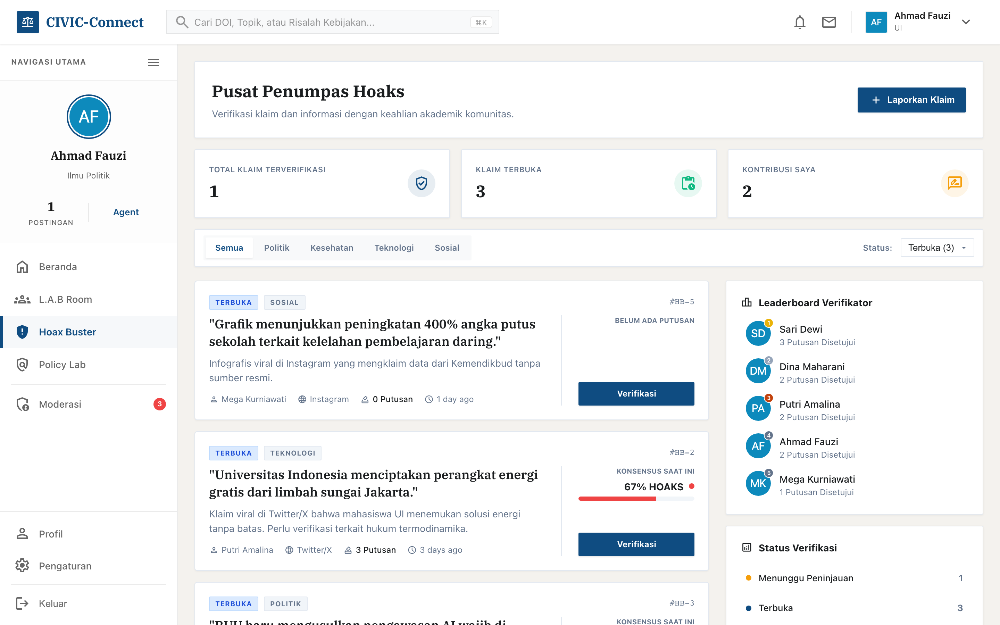

Dalam L.A.B Room, tahap Literasi difasilitasi melalui fitur **kurasi sumber referensi** secara kolaboratif. Setiap peserta dapat menambahkan sumber literatur dengan judul, URL, dan ringkasan konten, sehingga terbangun basis data referensi bersama sebelum memasuki tahap analisis. Metode ini melatih peserta untuk membedakan antara fakta, opini, dan manipulasi data.

### Tahap 2: A — Analisis Kritis (Proses)

Mahasiswa membedah masalah menggunakan pisau analisis akademik di dalam **ruang diskusi berthreaded** pada platform CIVIC-Connect. Diskusi tidak boleh berbasis asumsi ("katanya"), melainkan harus menggunakan kerangka **klaim (_claim_) dan bukti (_evidence_)** yang terstruktur. Setiap argumen dalam diskusi harus didukung oleh bukti yang dapat diverifikasi.

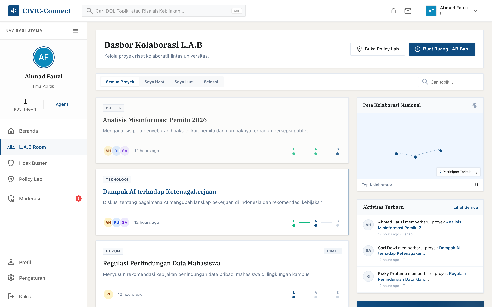

Platform menyediakan sistem **Top Voting** pada setiap komentar diskusi, di mana argumen terbaik dan paling berkualitas akan di-_top_ oleh peserta lain sehingga muncul paling atas. Mekanisme ini memastikan bahwa gagasan yang paling kuat secara argumentatif mendapat visibilitas tertinggi, bukan sekadar gagasan yang paling disukai. Tahap ini melatih mahasiswa untuk melihat masalah dari berbagai sudut pandang (_helicopter view_) dan menghindari bias kognitif.

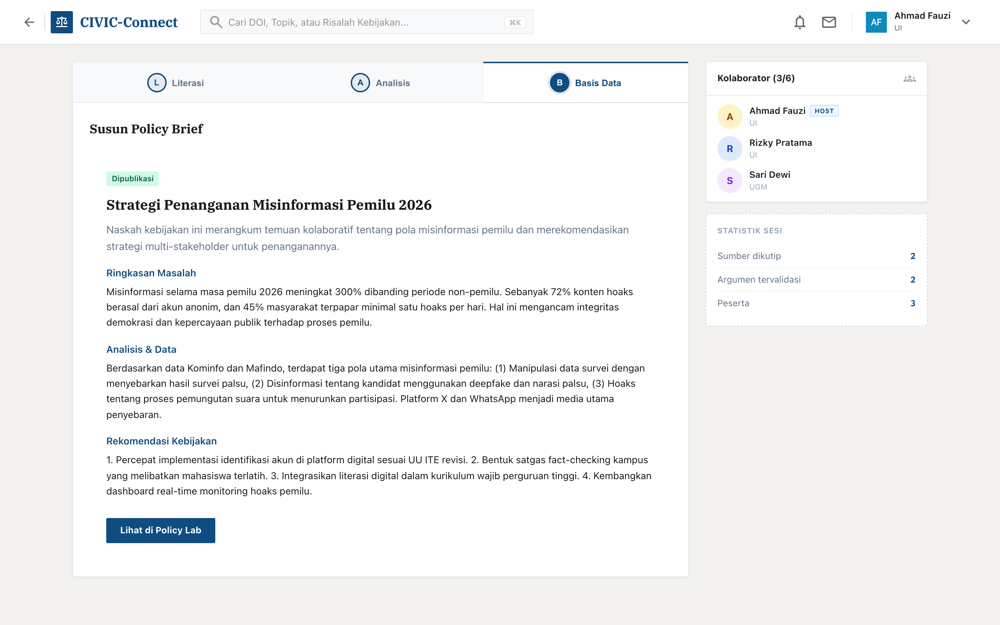

### Tahap 3: B — Basis Data (Output & Aksi)

Ini adalah **pembeda utama** CIVIC LAB dengan kelompok diskusi biasa. Hasil analisis dikonversi menjadi **Naskah Kebijakan (Policy Brief)** terstruktur yang berisi: (1) Ringkasan Masalah, (2) Analisis Berbasis Data, dan (3) Rekomendasi Kebijakan. Platform CIVIC-Connect menyediakan **tiga template standar** yang memandu mahasiswa dalam penyusunan:

| Template              | Deskripsi                                                                       |
| --------------------- | ------------------------------------------------------------------------------- |
| **Standar**           | Template umum cocok untuk berbagai isu kebijakan                                |
| **Data-Driven Brief** | Template yang menekankan pada penyajian data kuantitatif dan statistik          |
| **Quick Response**    | Template ringkas untuk merespons isu kebijakan yang membutuhkan tanggapan cepat |

Mahasiswa dilatih menggunakan template terstruktur ini sehingga gagasan mereka siap disajikan kepada rektorat atau pemerintah daerah (DPRD/Pemda). Setiap Policy Brief yang dihasilkan melewati proses **moderasi kualitas** oleh CIVIC Agent sebelum dipublikasikan ke repositori terbuka.

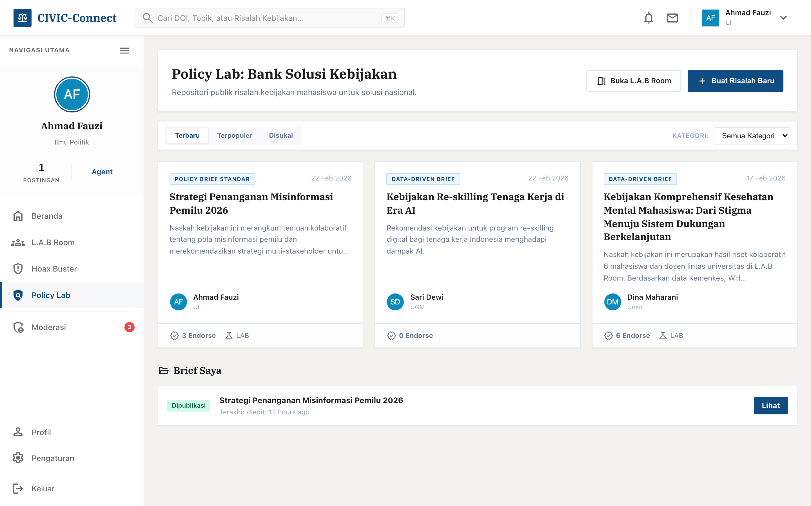

---

## 4. Integrasi Ekosistem Digital: Platform CIVIC-Connect

Untuk memperluas dampak di era global, CIVIC LAB didukung oleh platform digital terintegrasi bernama **CIVIC-Connect**. Platform ini telah dibangun secara fungsional dan berfungsi sebagai bank data solusi serta ruang kolaborasi antar-kampus. Keberterimaan inovasi teknologi ini sangat tinggi, dibuktikan dengan hasil survei di mana hampir seluruh responden menyatakan berminat menggunakan aplikasi/web yang memudahkan kolaborasi kajian isu sosial berbasis data.

Fitur utama CIVIC-Connect yang telah terimplementasi meliputi:

### a. Repository Policy Brief: Bank Solusi Kebijakan

Platform menyediakan **Bank Solusi Kebijakan (Policy Lab)** sebagai repositori publik risalah kebijakan mahasiswa yang dapat diakses oleh publik dan pemerintah. Setiap Policy Brief yang telah lolos moderasi dipublikasikan dalam repositori ini, meningkatkan transparansi dan akuntabilitas gerakan intelektual mahasiswa. Pengguna lain dapat memberikan **endorsement** ("Setuju") pada Policy Brief yang dinilai berkualitas, menciptakan mekanisme validasi gagasan berbasis komunitas.

### b. Pusat Penumpas Hoaks (Hoax Buster Center)

Fitur ini merupakan kanal verifikasi isu yang dikelola secara kolaboratif oleh mahasiswa untuk menjernihkan ruang digital dari disinformasi. Sistem verifikasi berjalan secara komunal: setiap pengguna dapat melaporkan klaim mencurigakan, kemudian komunitas memberikan putusan (Valid/Menyesatkan/Hoaks) berdasarkan bukti dan penalaran. Platform juga menampilkan **Leaderboard Verifikator** — peringkat kontributor verifikasi terbanyak — sebagai bentuk rekognisi terhadap mahasiswa yang paling aktif berkontribusi dalam pemberantasan hoaks.

### c. L.A.B Room: Ruang Riset Kolaboratif

Fitur ini mengoperasionalkan metode L.A.B secara digital. Setiap ruang diskusi memiliki **tiga fase yang berurutan** (Literasi → Analisis → Basis Data) dan hanya dapat dimajukan oleh moderator ruang setelah fase sebelumnya dinilai cukup matang. Peserta dapat bergabung dan berkontribusi secara kolaboratif di setiap fase. Luaran akhir fase Basis Data langsung terhubung ke pembuatan Policy Brief di repositori Policy Lab.

### d. Feed Beranda dengan Kontrol Kualitas

Platform menyediakan feed beranda dengan dua jenis konten utama:

- **Postingan Fact-Check** — pengguna dapat memberikan penilaian "Hoaks" atau "Fakta" terhadap klaim yang beredar, dilengkapi fitur **"Lihat Sumber"** yang menampilkan sitasi/referensi yang digunakan penulis. Postingan tanpa referensi akan ditandai dengan label peringatan **"Tanpa Sumber"** sebagai edukasi budaya akademik.
- **Postingan Artikel** — pengguna dapat memberikan **Endorsement** ("Setuju") terhadap gagasan yang dinilai berkualitas.

Setiap postingan dilengkapi sistem **komentar berthreaded** dengan mekanisme **Top Voting**, serta tombol **Bagikan (Share)** untuk memperluas diseminasi informasi yang telah terverifikasi.

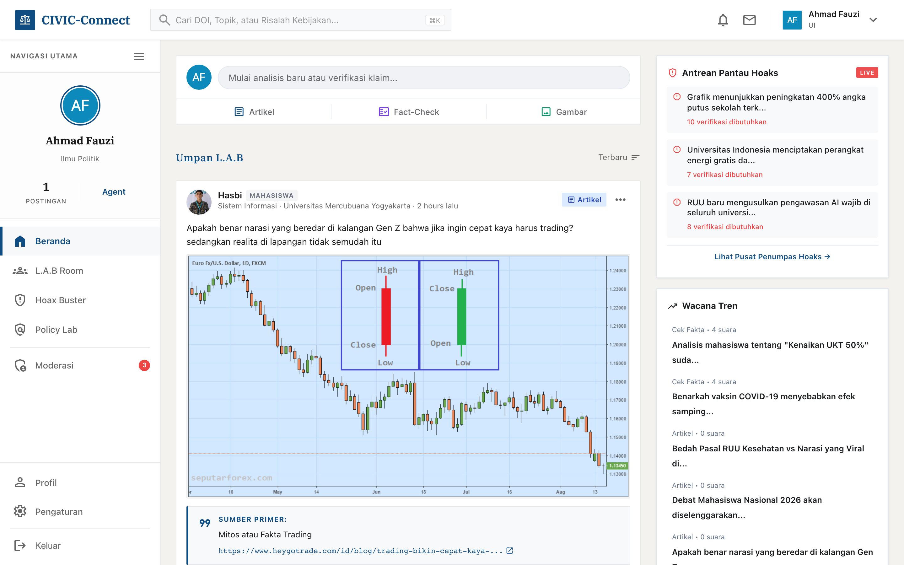

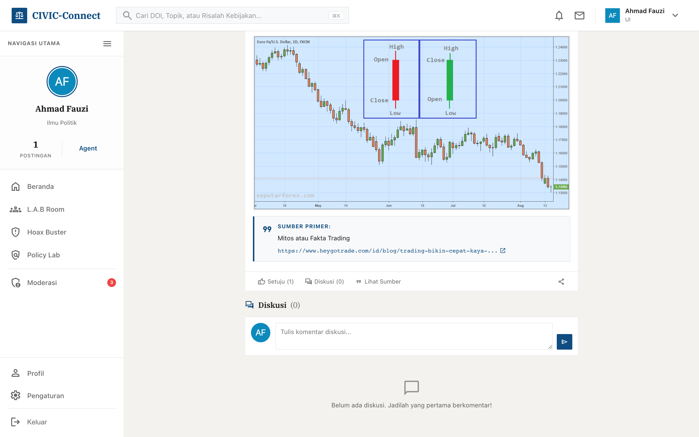

### e. Sistem Moderasi oleh CIVIC Agent

Seluruh konten yang diproduksi di platform — postingan, Policy Brief, klaim hoaks, dan putusan verifikasi — melewati proses **moderasi kualitas** oleh CIVIC Agent sebelum ditampilkan secara publik. CIVIC Agent adalah mahasiswa terlatih yang berperan sebagai penjaga kualitas konten platform. Panel Moderasi menyediakan antarmuka yang terintegrasi untuk meninjau, menyetujui, atau menolak konten beserta alasan penolakan.

Selain itu, platform menyediakan **sistem pelaporan konten** (_content reporting_) di mana pengguna dapat melaporkan postingan yang dinilai bermasalah, yang kemudian masuk ke panel moderasi untuk ditindaklanjuti. Mekanisme ini menciptakan komunitas yang _self-governing_ — dikelola oleh dan untuk mahasiswa sendiri.

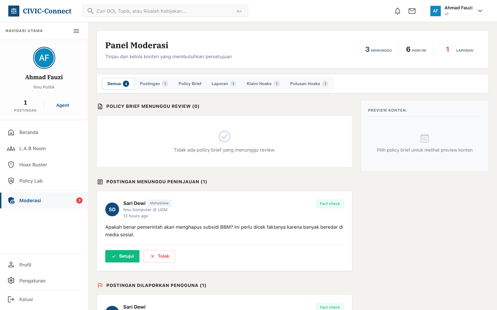

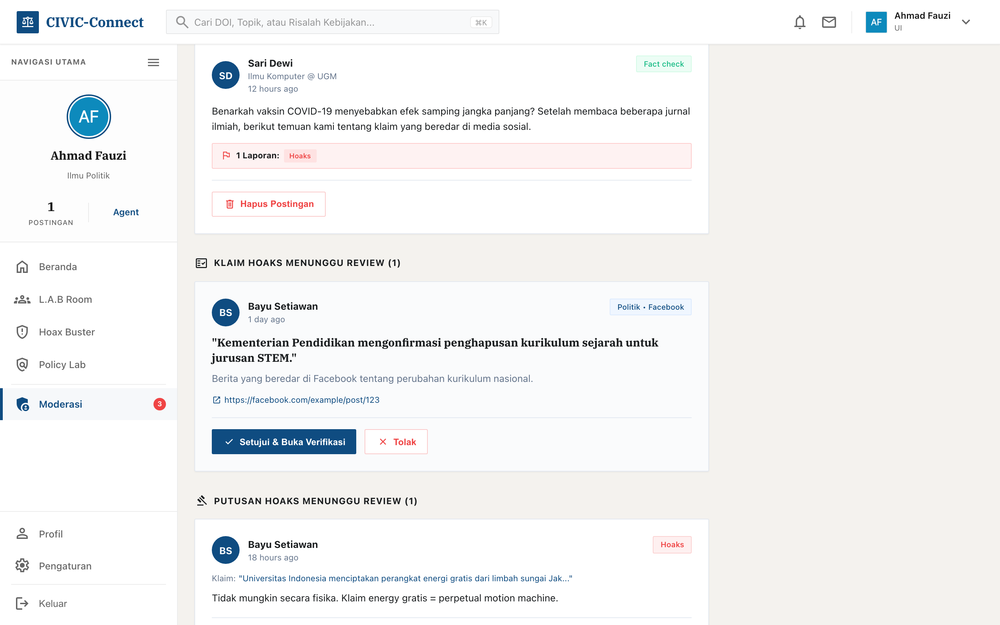

### f. Mode Akses Anonim

Untuk mengakomodasi kebutuhan privasi, platform menyediakan **mode akses anonim** yang memungkinkan pengguna mengakses konten platform tanpa mendaftarkan identitas. Fitur ini merupakan langkah awal perlindungan pengguna dari risiko intimidasi saat mengkritisi isu sensitif.

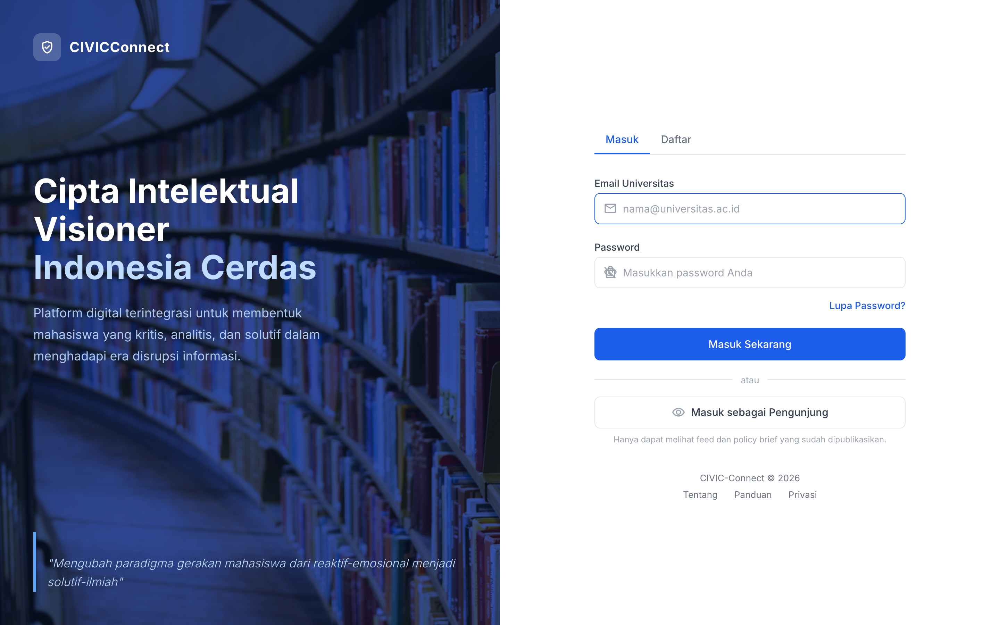

---

## 5. Simulasi Penerapan Terbatas

Penulis telah melakukan simulasi terbatas metode L.A.B pada kelompok diskusi kecil beranggotakan **5 mahasiswa** untuk membahas isu **"Sampah Plastik di Kampus."** Dalam waktu **3 hari**, tim berhasil:

| Tahap              | Kegiatan                                                                                                         | Capaian                        |
| ------------------ | ---------------------------------------------------------------------------------------------------------------- | ------------------------------ |
| **L (Literasi)**   | Mengumpulkan data volume sampah dan referensi regulasi terkait                                                   | Basis data referensi terbangun |
| **A (Analisis)**   | Menganalisis penyebab perilaku buang sampah dan mengidentifikasi akar masalah melalui diskusi berbasis bukti     | Temuan analitis terstruktur    |
| **B (Basis Data)** | Menghasilkan satu draf usulan peraturan rektor tentang pengurangan plastik dalam format Policy Brief terstruktur | 1 Policy Brief siap ajukan     |

Hal ini membuktikan bahwa dengan metode yang tepat, mahasiswa mampu berpikir solutif dan berbasis data dalam waktu singkat.

---

## 6. Analisis Kelayakan dan Keberlanjutan (SWOT)

**Tabel 1. Analisis SWOT dan Strategi Keberlanjutan CIVIC LAB**

| Matriks SWOT                | Analisis                                                                                                                                                                                                                                                                                                                                                                                                                                                                                                                                                                                                                                                                       | Strategi Mitigasi / Penguatan                                                                                                                                                                                                                                                                           |
| --------------------------- | ------------------------------------------------------------------------------------------------------------------------------------------------------------------------------------------------------------------------------------------------------------------------------------------------------------------------------------------------------------------------------------------------------------------------------------------------------------------------------------------------------------------------------------------------------------------------------------------------------------------------------------------------------------------------------ | ------------------------------------------------------------------------------------------------------------------------------------------------------------------------------------------------------------------------------------------------------------------------------------------------------- |
| **STRENGTHS (Kekuatan)**    | 1. **Validasi Pasar Tinggi:** 95,7% responden menyatakan berminat menggunakan platform digital kolaborasi kajian berbasis data. 2. **Metode Terintegrasi:** Menggabungkan pelatihan offline (L.A.B) dengan tools digital (CIVIC-Connect) yang memiliki fitur Hoax Buster, L.A.B Room, dan Policy Lab terintegrasi. 3. **Output Konkret:** Menghasilkan produk legal-akademis (Policy Brief) yang dipublikasikan ke repositori terbuka, menjawab kebutuhan 95% mahasiswa yang merasa demo saja tidak cukup. 4. **Kontrol Kualitas Bawaan:** Sistem moderasi oleh CIVIC Agent dan mekanisme Top Voting memastikan hanya gagasan berkualitas yang mendapat visibilitas tertinggi. | Mengajukan hak cipta (HaKI) atas platform CIVIC-Connect dan menjalin kemitraan dengan BEM Universitas se-Indonesia untuk mempercepat adopsi pengguna (_user acquisition_) memanfaatkan tingginya minat pasar.                                                                                           |
| **WEAKNESSES (Kelemahan)**  | 1. **Kesenjangan Kompetensi (_Skill Gap_):** 75% lebih responden mengaku "Tidak Tahu" atau "Tidak Bisa" membuat Policy Brief, menuntut intensitas pelatihan yang tinggi. 2. **Keterbatasan Sumber Daya:** Pengembangan dan pemeliharaan server aplikasi membutuhkan biaya operasional.                                                                                                                                                                                                                                                                                                                                                                                         | Mengintegrasikan modul pelatihan CIVIC LAB ke dalam program MBKM atau SKPI (Surat Keterangan Pendamping Ijazah) pada tahap pengembangan jangka menengah, agar mahasiswa mendapat insentif akademik. Untuk pendanaan awal, mengikuti hibah kompetisi (seperti PKM) dan kerja sama sponsorship.           |
| **OPPORTUNITIES (Peluang)** | 1. **Agenda Nasional:** Mendukung Peta Jalan Literasi Digital Kominfo, khususnya pilar _Digital Ethics_ & _Digital Culture_ yang skornya sedang ditingkatkan. 2. **Ekosistem Digital:** Penetrasi internet 78,19% di Indonesia didominasi Gen-Z, memudahkan diseminasi gagasan via platform.                                                                                                                                                                                                                                                                                                                                                                                   | Memperluas fungsi Mode Akses Anonim yang **telah terimplementasi** di platform menjadi sistem perlindungan privasi yang lebih komprehensif untuk melindungi pengguna dari ancaman _doxing_ saat menyuarakan kritik publik.                                                                              |
| **THREATS (Ancaman)**       | 1. **Serangan Siber & Buzzer:** Risiko peretasan atau serangan opini dari buzzer politik yang anti-kritik. 2. **Budaya Instan (_Doomscrolling_):** Tantangan mengubah kebiasaan mahasiswa yang cenderung menyukai konten pendek/viral (46% hanya baca judul).                                                                                                                                                                                                                                                                                                                                                                                                                  | Memanfaatkan elemen kompetitif yang sudah ada di platform — seperti Leaderboard Verifikator dan Top Voting — serta mengembangkan sistem gamifikasi yang lebih komprehensif (poin/reward) pada fase pengembangan lanjutan untuk membuat proses pembuatan kajian lebih menarik dan melawan budaya instan. |

---

## 7. Penutup

CIVIC LAB dengan platform CIVIC-Connect hadir sebagai jawaban atas tiga persoalan fundamental: lemahnya budaya verifikasi, absennya keterampilan advokasi kebijakan, dan tidak adanya wadah kolaboratif yang menjembatani gagasan mahasiswa dengan pengambil kebijakan. Dengan metode **L.A.B (Literasi → Analisis → Basis Data)** yang telah terimplementasi dalam platform digital fungsional, mahasiswa tidak lagi sekadar menjadi penonton pasif di ruang digital, melainkan aktor intelektual yang mampu memproduksi solusi berbasis data.

Melalui fitur-fitur yang telah terbangun — **Pusat Penumpas Hoaks** untuk verifikasi kolaboratif, **L.A.B Room** untuk riset terstruktur, **Bank Solusi Kebijakan** sebagai repositori Policy Brief, **sistem moderasi** untuk kontrol kualitas, serta mekanisme **Top Voting** dan **endorsement** untuk memunculkan gagasan terbaik — CIVIC-Connect bukan lagi sekadar konsep, melainkan prototipe fungsional yang siap diuji coba secara lebih luas.

Pada akhirnya, CIVIC LAB bukan hanya tentang melawan hoaks atau menulis Policy Brief. Ini tentang membentuk generasi mahasiswa yang memiliki **imunitas kognitif** — yang tenang saat menerima informasi (_Neng_), jernih saat berpikir (_Ning_), kuat saat merumuskan gagasan (_Nung_), dan menghasilkan kemenangan berupa solusi nyata bagi bangsa (_Nang_). Inilah wujud nyata dari **Cipta Intelektual Visioner Indonesia Cerdas**.

---

## Lampiran: Tangkapan Layar Platform CIVIC-Connect

### A. Halaman Login & Registrasi

### B. Beranda — Feed Konten

### C. Beranda — Voting

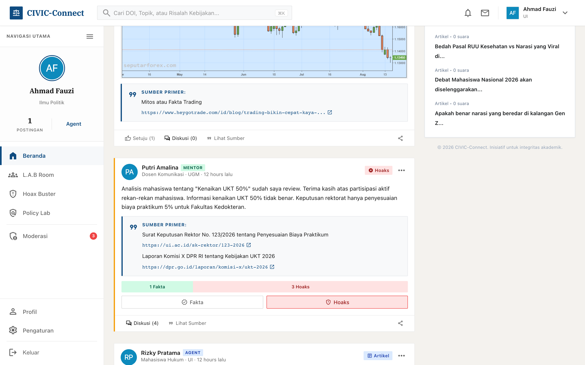

### D. Pusat Penumpas Hoaks

### E. Detail Klaim Hoaks

### F. L.A.B Room

### G. Detail L.A.B Room

### H. Diskusi L.A.B Room

### I. Policy Lab

### J. Detail Policy Brief

### K. Panel Moderasi

### L. Riwayat Moderasi

### M. Detail Posting

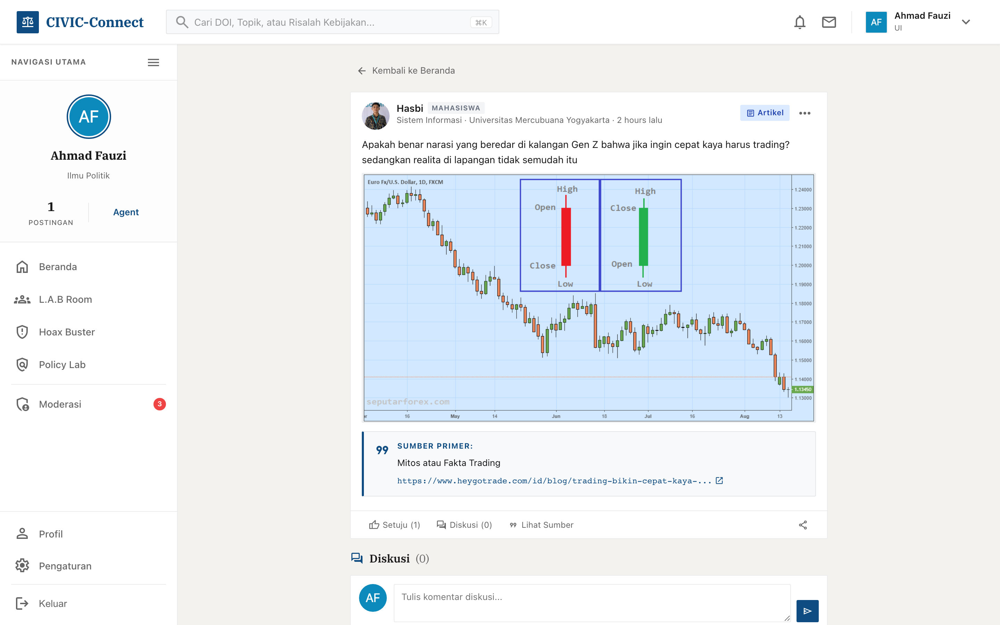

### N. Komentar & Top Voting

### O. Profil Pengguna

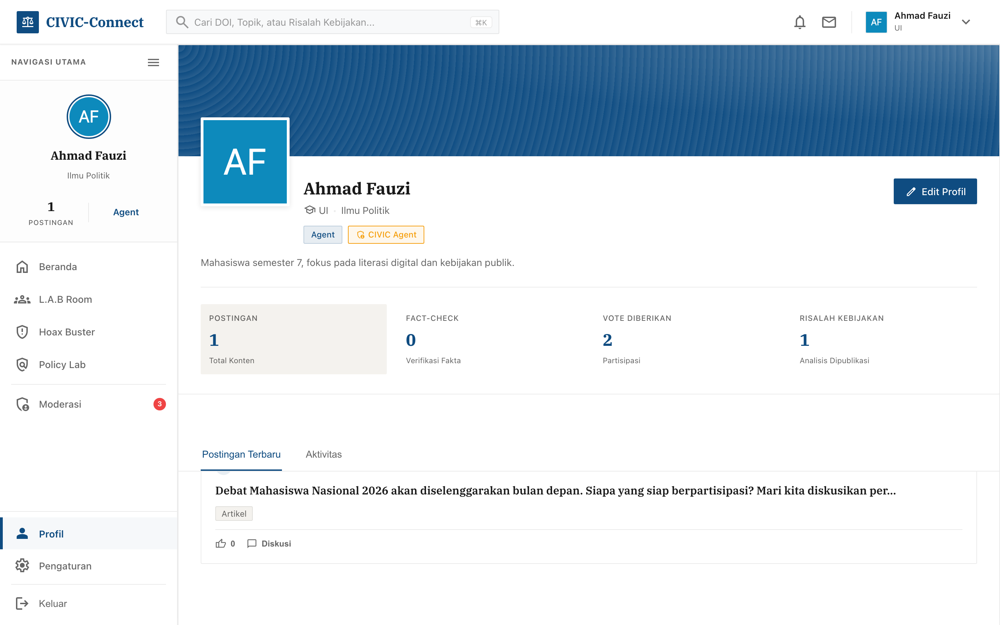

---

_Dokumen ini dihasilkan dari platform CIVIC-Connect yang berjalan di lingkungan pengembangan. Tangkapan layar diambil secara otomatis dari instance aplikasi yang aktif._
